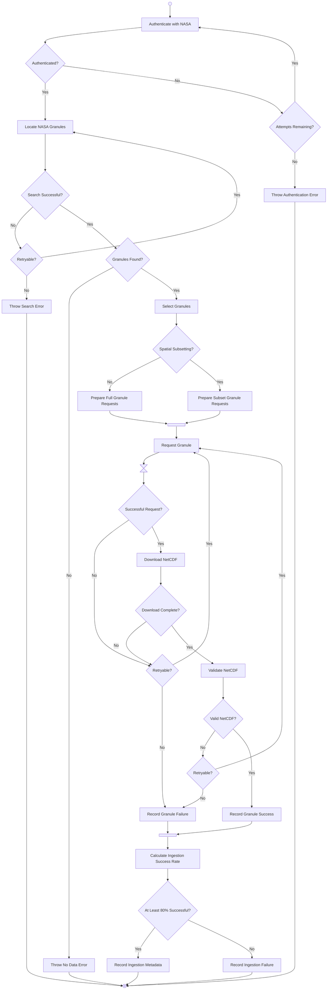
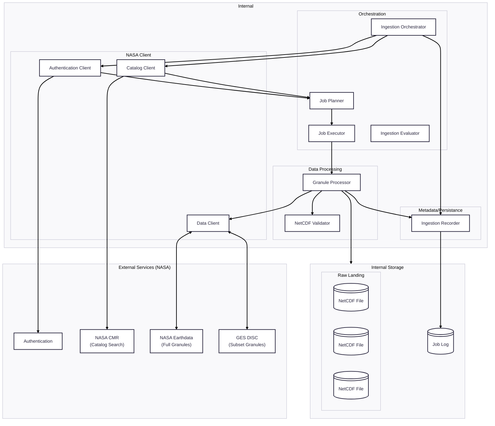

# NLDAS Ingestion

## Activity Diagram
- - - 

# Mapping Responsibility~Activity
- - -
| Activity / Decision              | Responsibility                                           | Proposed Component                           | Inputs                                 | Outputs                     |
| -------------------------------- | -------------------------------------------------------- | -------------------------------------------- | -------------------------------------- | --------------------------- |
| Authenticate with NASA           | Establish authenticated NASA session                     | **NASA Authentication Client**               | NASA credentials/configuration         | Authenticated session       |
| Authenticated?                   | Determine whether authentication succeeded               | **NASA Authentication Client**               | Authentication response                | Success/failure             |
| Attempts Remaining?              | Apply authentication retry policy                        | **NASA Authentication Client**               | Attempt count, retry policy            | Retry / fail                |
| Locate NASA Granules             | Search NASA catalog for matching granules                | **NASA Catalog Client**                      | Search criteria                        | Granule metadata            |
| Search Successful?               | Determine whether catalog request succeeded              | **NASA Catalog Client**                      | Catalog response                       | Success/failure             |
| Retryable?                       | Determine whether failed operation should be retried     | **NASA Catalog Client / Retrieval Executor** | Error, retry policy                    | Retry / fail                |
| Granules Found?                  | Determine whether search produced usable granules        | **Retrieval Planner**                        | Granule metadata                       | Continue / no-data          |
| Select Granules                  | Select granules relevant to ingestion                    | **Retrieval Planner**                        | Granule metadata, ingestion criteria   | Selected granules           |
| Spatial Subsetting?              | Determine retrieval strategy                             | **Retrieval Planner**                        | Ingestion configuration                | Full/subset strategy        |
| Prepare Full Granule Requests    | Construct full-granule jobs                              | **Retrieval Planner**                        | Selected granules                      | Full `GranuleJob`s          |
| Prepare Subset Granule Requests  | Construct spatial-subset jobs                            | **Retrieval Planner**                        | Selected granules, spatial extent      | Subset `GranuleJob`s        |
| Fork Granule Requests            | Submit independent granule jobs for concurrent execution | **Retrieval Executor**                       | Collection of `GranuleJob`s            | Concurrent executions       |
| Request Granule                  | Retrieve requested NASA data                             | **NASA Data Client**                         | `GranuleJob` retrieval information     | NASA response/data          |
| Await Granule Response           | Manage completion of NASA request                        | **NASA Data Client / Retrieval Executor**    | Active request                         | Response/result             |
| Successful Request?              | Determine whether NASA request succeeded                 | **NASA Data Client**                         | NASA response                          | Success/failure             |
| Retryable?                       | Determine whether retrieval failure should be retried    | **Retrieval Executor**                       | Error/result, retry policy             | Retry / record failure      |
| Download NetCDF                  | Retrieve NetCDF content                                  | **NASA Data Client**                         | NASA granule/request                   | Local/temporary NetCDF      |
| Download Complete?               | Determine whether transfer completed                     | **NASA Data Client**                         | Download result                        | Complete/incomplete         |
| Validate NetCDF                  | Verify retrieved dataset is usable                       | **NetCDF Validator**                         | NetCDF file/data                       | Validation result           |
| Valid NetCDF?                    | Determine whether dataset passed validation              | **NetCDF Validator**                         | Validation result                      | Valid/invalid               |
| Record Granule Success           | Record successful granule processing                     | **Ingestion Recorder**                       | Granule result, metadata               | Success record              |
| Record Granule Failure           | Record unsuccessful granule processing                   | **Ingestion Recorder**                       | Granule result, error information      | Failure record              |
| Join Granule Results             | Wait for all concurrent granule jobs to finish           | **Retrieval Executor**                       | Individual job results                 | Complete result set         |
| Calculate Ingestion Success Rate | Calculate batch-level success percentage                 | **Ingestion Evaluator**                      | Granule results                        | Success rate                |
| At Least 80% Successful?         | Apply ingestion acceptance criterion                     | **Ingestion Evaluator**                      | Success rate, threshold                | Successful/failed ingestion |
| Record Ingestion Metadata        | Record overall ingestion/provenance information          | **Ingestion Recorder**                       | Ingestion results, job metadata        | Ingestion record            |
| Record Ingestion Failure         | Record failed ingestion outcome                          | **Ingestion Recorder**                       | Evaluation result, failure information | Failure record              |
| Overall workflow coordination    | Coordinate the entire ingestion lifecycle                | **Ingestion Orchestrator**                   | Configuration, component results       | Ingestion completion/status |

# Component Diagram
Shows interactions between key system components

