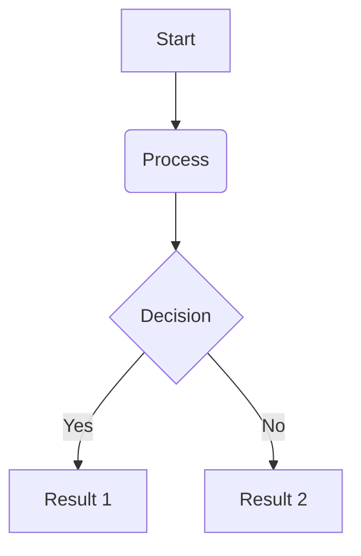

# Hydro Data Platform Project

Data platform for data used as input for hydrologic modeling

This repository is the product of a fictional data engineering consulting project. It includes both the source code and project documentation for a data platform built to serve the business needs of a fictional Water Resources consultant firm specializing in hydrologic modeling and ananlysis.

# High-Level Architecture (Draft)

## Storage
The data platform will feature a lakehouse architecture built atop local object storage. Apache Iceberg will serve as the open table format to manage metadata, while a centralized catalog will handle table discovery and atomic state changes. The data architecture will follow a medallion structure (bronze, silver, and gold layers) supplemented by a raw landing zone.

### Storage Zone Breakdown
**Landing:** _Raw data preserved from upstream source._ 
**Bronze:** _Validated data that is safe for downstream processing._ 
**Silver:** _Cleansed, standardized, curated and integrated enterprise data._ 
**Gold:** _Business-ready data that has been modeled and optimized for analyics and hydrologic modeling._ 

